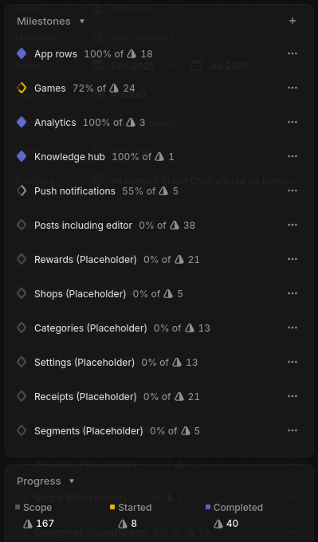
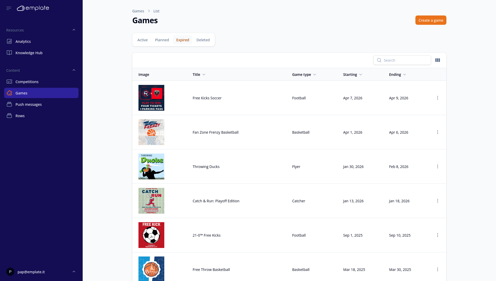

<!-- headingDivider: 1 -->

<!-- _class: lead -->
# From Angular to Filament: Ditching the SPA
Laravel Meetup Aarhus
2026-04-30
 

# Christoffer Berg Boisen

Co-founder & CTO Emplate ApS

# Agenda

* Before Filament: Angular monorepo
* Introduction to Filament
    * Concepts
    * Code time!
* State of migration
* Verdict

*Slides & code available at [github.com/cboisen/2026-04-laravel-meetup](https://github.com/cboisen/2026-04-laravel-meetup)*

# Emplate

# Before filament: Angular monorepo

Multiple "projects", a shared component library and 2-4 applications

Code reuse for frontend OK

Worked ok with dedicated frontend developers

Potential discrepancy in API expectations between backend and frontend

**An Agent is not able to make features e2e**

# What are we looking for in a solution?

1. One unified code base
2. Integrates well with Laravel
3. A comprehensive UI library (tables, input fields¸ media handling)
4. Easy to make our own custom components and tweaks
5. Extensive documentation
6. Feel familiar to us (Laravel + Livewire knowledge)
7. Open source, stong community backing

# Comparison of some options

| Option | Laravel fit | CMS-friendly | Customizable | Docs / community | Licensing |
| --- | --- | --- | --- | --- | --- |
| **Filament** | 🟢 | 🟢 | 🟢 | 🟢 | 🆓 |
| **Backpack** | 🟢 | 🟢 | 🟡 | 🟢 | 💵 |
| **Nova** | 🟢 | 🟢 | 🟡 | 🟢 | :lock:💵 |
| **Livewire + Flux / Volt** | 🟢 | 🟡 | 🟢 | 🟡 | 💵 |
| **Inertia + Vue** | 🟡 | 🔴 | 🟢 | 🟢 | 🆓 |

*`🆓` fully open source, `💵` open core / paid upgrades for full experience*

# Filament
Livewire components & views

Centers around the concept of a **resource**

CRUD & Tables at the center, but you can bring your own Livewire components

Filament has a Laravel Boost skill ⚡️

https://filamentphp.com/

# State of migration
1 app done ✅
1 app in progress: 3 of 12 modules done.

Established own UI patterns and concepts

The more you diverge from "Filament default", the more code you have to bring

# Games
[emplate.dev](emplate.dev/cms)

# Verdict
👍️ Development much faster than before

🤖 Surprised with how well an agent is able to flesh out modules

Traits til common patterns - det er bare PHP

⚠️ Testing is good, but know what you test (they are not browser tests)