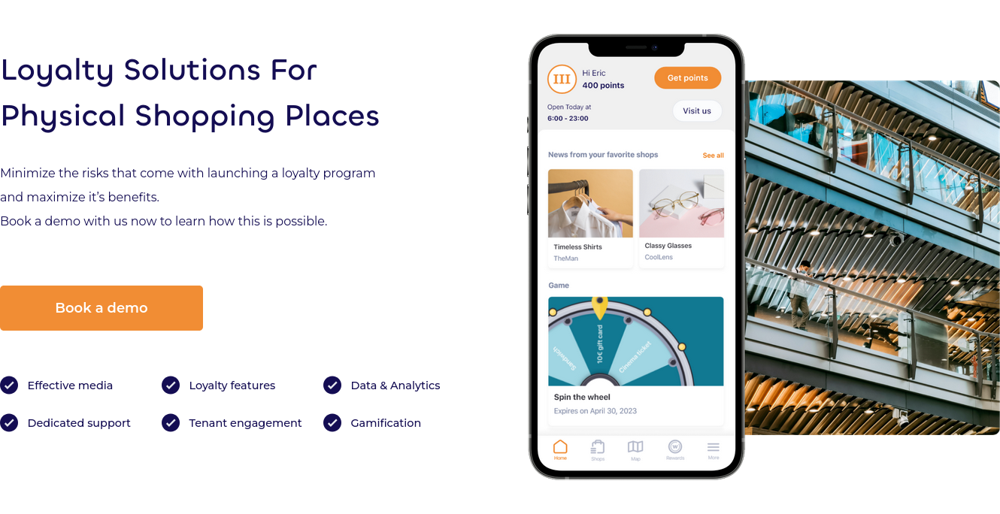
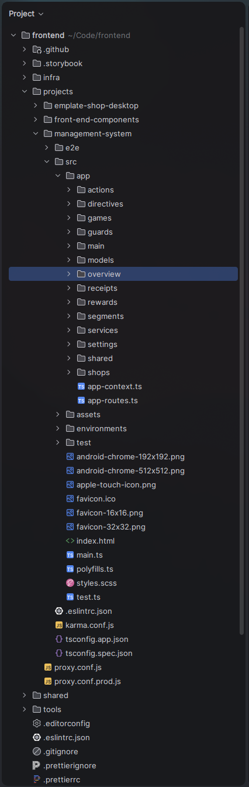

<!-- headingDivider: 1 -->

<!-- _class: lead -->
# From Angular to Filament: Ditching the SPA
Laravel Meetup Aarhus
2026-04-29
 

# Christoffer Berg Boisen

Co-founder & CTO Emplate ApS

# Agenda

* Before Filament: Angular monorepo
* Introduction to Filament
    * Concepts
    * Code time!
* State of migration
* Verdict

*Slides & code available at https://github.com/cboisen/2026-04-laravel-meetup*

# Emplate

# Before filament: Angular monorepo

Multiple "projects", a shared component library and 2-4 applications

Code reuse for frontend OK

Worked ok with dedicated frontend developers

Potential discrepancy in API expectations between backend and frontend

# Something else